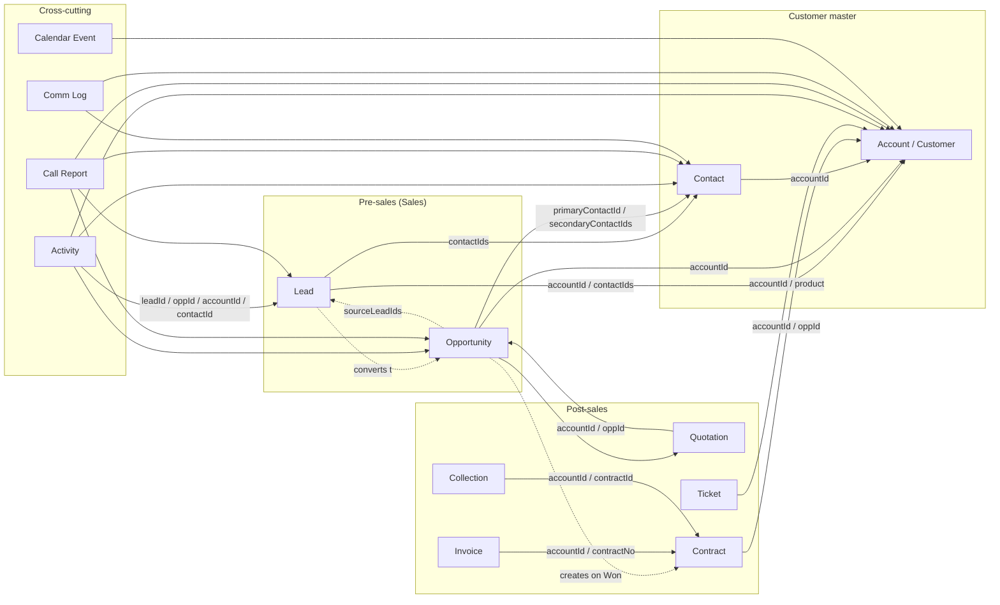
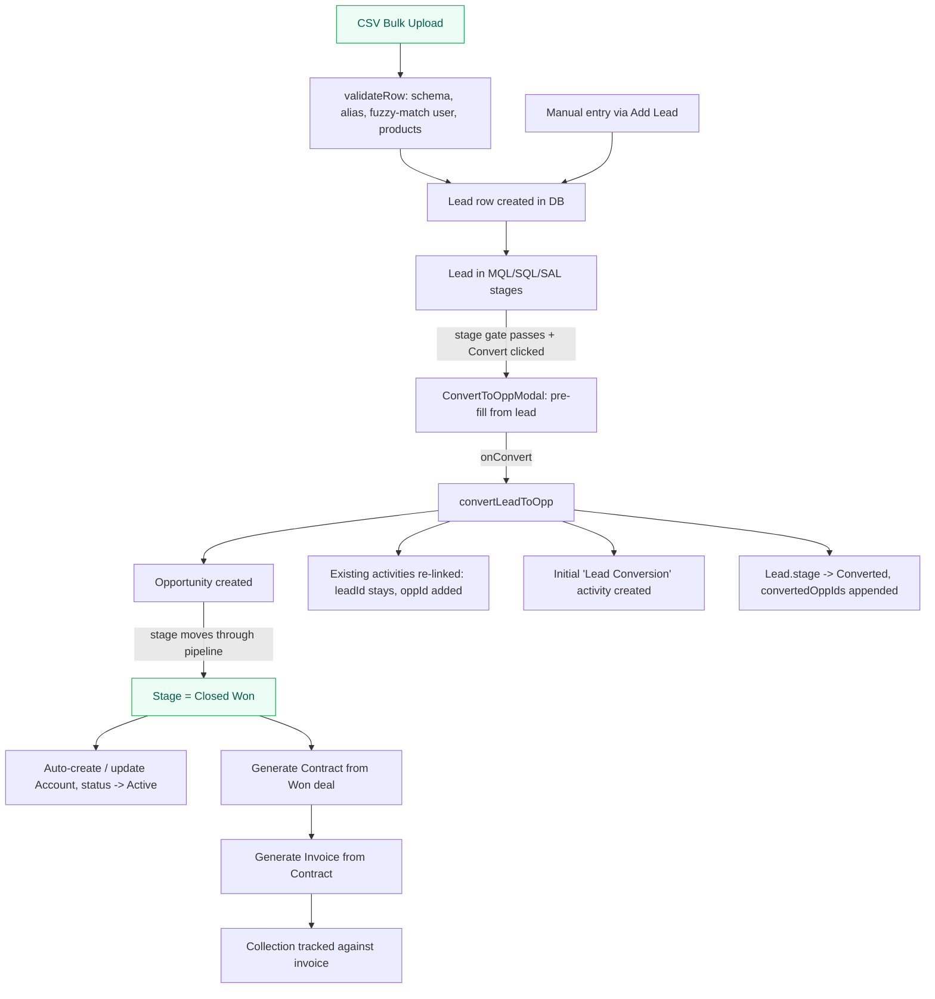
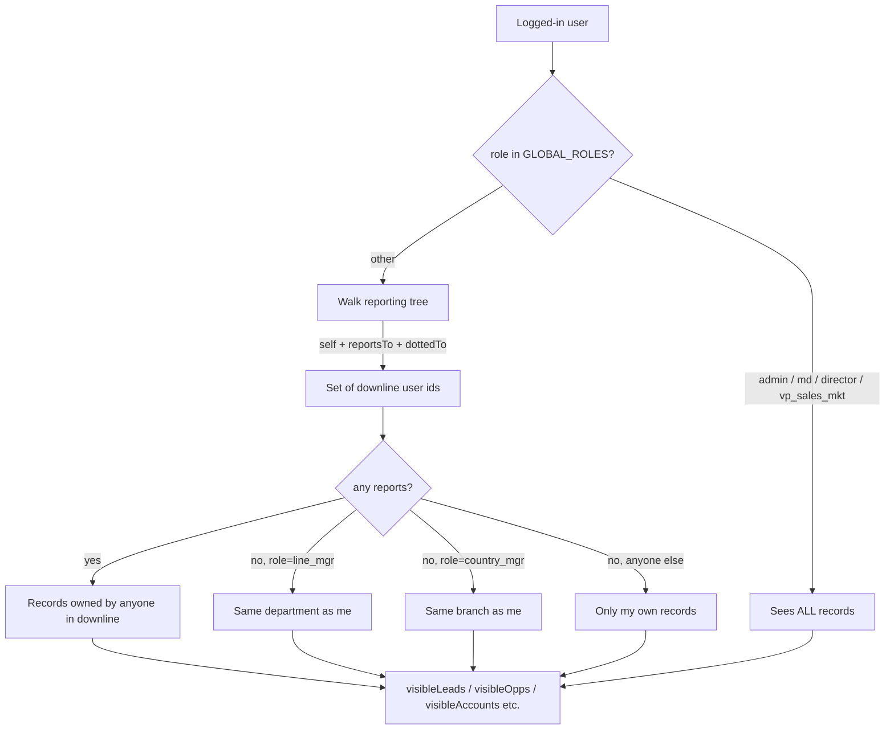
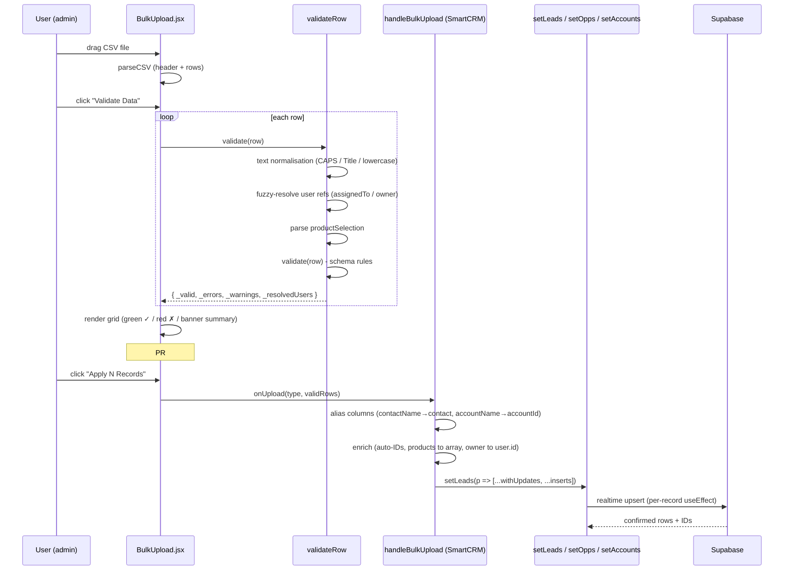
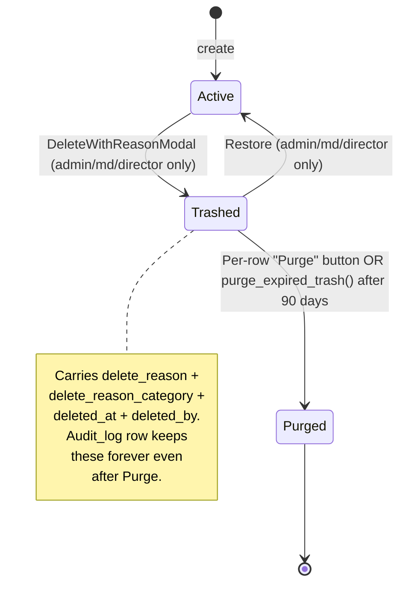
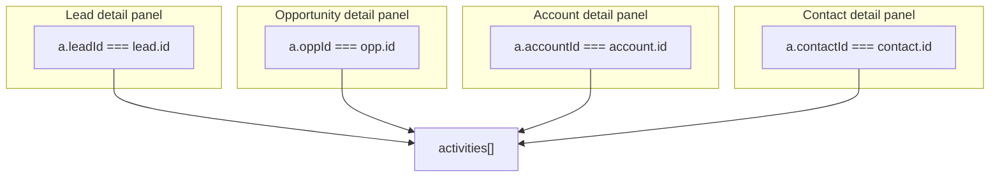

# SmartCRM — Data Flow & Architecture Reference

> One-stop visual reference for how data moves through SmartCRM. Renders
> natively on GitHub. Use this when triaging field issues to figure out
> where the bug is most likely living before opening files.
>
> Last updated: PR #130 (lead detail timeline strict filter)

---

## 1. Entity relationship overview

How the core records reference each other. Solid arrows = stored
foreign keys; dashed arrows = derived rollups (e.g. dashboard counts).



**Key invariants:**
- Every Account has a stable `id`. Every Contact must point at an
  Account (PR #102 mandate).
- An Opportunity's `sourceLeadIds[]` keeps the audit trail back to
  the lead it was converted from. The lead's `convertedOppIds[]`
  mirrors this.
- An Activity can carry **all four** FKs (`leadId`, `oppId`,
  `accountId`, `contactId`). The strict-per-record timeline filters
  in detail panels rely on this.

---

## 2. Lead-to-cash lifecycle

End-to-end flow of a record as it advances through the funnel.



**Where things have broken in the field (since fixed):**
- `contactName` CSV column never populated `contact` field on the
  lead → fixed in PR #123
- Contacts CSV: `accountName` column not resolved, array fields
  landed as strings, `primary` boolean read as truthy string →
  fixed in PR #124
- Bulk-uploaded leads landed unassigned because fuzzy user
  resolution silently dropped on no-match → fixed in PR #125 (preview)
  + #127 (block + summary banner)
- Lead Est. Value didn't carry through to Opp on conversion → fixed
  in PR #129 (modal pre-fill + handler fallback)
- Pipeline Value KPI used `score × 0.5` placeholder instead of the
  rep-entered Est. Value → fixed in PR #128

---

## 3. User scoping & visibility (waterfall)

Who can see which records. The waterfall is computed once per render
in `getScopedUserIds`; every visible* memo in SmartCRM filters by it.



**Waterfall property:** if A reports up to B (via `reportsTo` or
`dottedTo[]`), every record A owns appears in B's scope automatically.
This is why managers see their reps' data without manual sharing.

**Common field issue:** "I assigned a lead to X but X can't see it"
→ usually means X's `orgUsers` row is missing `reportsTo`, OR the
lead's `assignedTo` got the wrong user-id from a fuzzy CSV match
(see Section 4 below for prevention; #125/#127 surface this in the
UI now).

---

## 4. Bulk upload pipeline

What happens between drag-and-drop and "Apply N Records".



**Validation gates:**
1. Mandatory column presence
2. Per-row schema check (e.g. `validate(row)` in each module schema)
3. Fuzzy user resolution — exposed prominently after #125, blocking
   after #127
4. Product/module selection parsed from string syntax
5. Reference key match to detect UPDATE vs INSERT

---

## 5. Sync architecture

Triple-tier state: React in-memory, localStorage cache, Supabase
durable. The cache is what bites when "I updated the DB but the UI
shows old data".

```mermaid
flowchart LR
  subgraph BROWSER["Browser"]
    REACT[React state in SmartCRM.jsx]
    LS[localStorage<br/>smartcrm_data]
  end
  subgraph CLOUD["Supabase"]
    PG[(Postgres tables)]
    RT[Realtime channel]
  end

  REACT -->|setX(...) triggers useEffect| LS
  REACT -->|insertRecord / updateRecord| PG
  PG -->|broadcast on INSERT/UPDATE/DELETE| RT
  RT -->|subscribeToChanges callback| REACT
  LS -->|saved on load fallback| REACT
  PG -->|loadAllData on mount| REACT
```

**Diagnostic: "I changed data via SQL but UI didn't update"**
1. Open DevTools → Application → Local Storage
2. Delete the `smartcrm_data` key
3. Hard refresh (Ctrl+Shift+R)
4. App re-fetches from Supabase. UI now reflects DB truth.

**Why localStorage exists at all:** offline / first-paint speed.
Without it, every page load shows a loading spinner for 2-3s while
Supabase queries finish. Tradeoff: occasionally serves stale data
after manual SQL edits — see diagnostic above.

---

## 6. Soft-delete & 90-day retention



**RLS-tightened DELETE policies** (post #122): only `admin / md /
director` can DELETE rows on `accounts / leads / opportunities /
contacts`. Other modules still use the broader `FOR ALL` policy
because they're soft-delete-only via the front-end (defense-in-depth
gap, not currently exploitable).

---

## 7. Activity timeline filtering (per detail panel)

This is where the "FEDEX shows SHIV's activities" bug lived. The
fix in #130 made each panel scope strictly on its own row's `id`.



**Why strict matters:** before #130, the Lead panel matched on
`accountId` too. New bulk-imported leads with `accountId === ""`
all matched each other, so every lead showed every other lead's
activities. The bug only existed in Leads (other panels keyed on
their own row's `id`, never empty).

---

## 8. Modules at a glance

What lives where, with the source file for fast lookup.

| Module | Source | Visibility filter | Bulk upload? |
|---|---|---|---|
| Leads | [Leads.jsx](../src/components/Leads.jsx) | `assignedTo ∈ scopedIds` | ✅ |
| Pipeline (Opps) | [Pipeline.jsx](../src/components/Pipeline.jsx) | `owner ∈ scopedIds` | ✅ |
| Accounts (Customers) | [Accounts.jsx](../src/components/Accounts.jsx) | `owner ∈ scopedIds` | ✅ |
| Contacts | [Contacts.jsx](../src/components/Contacts.jsx) | shared (anyone sees all) | ✅ |
| Activities | [Activities.jsx](../src/components/Activities.jsx) | `owner ∈ scopedIds` | ❌ |
| Call Reports | [CallReports.jsx](../src/components/CallReports.jsx) | `marketingPerson ∈ scopedIds` | ❌ |
| Tickets | [Tickets.jsx](../src/components/Tickets.jsx) | `assigned ∈ scopedIds` | ✅ |
| Quotations | [Quotations.jsx](../src/components/Quotations.jsx) | `owner ∈ scopedIds` | ❌ |
| Contracts | [Contracts.jsx](../src/components/Contracts.jsx) | `owner ∈ scopedIds` | ✅ |
| Collections | [Collections.jsx](../src/components/Collections.jsx) | `owner ∈ scopedIds` | ✅ |
| Invoices | [Quotations.jsx → Invoices](../src/components/Quotations.jsx) | `owner ∈ scopedIds` | ✅ |
| Communications | [CommLog.jsx](../src/components/CommLog.jsx) | `owner ∈ scopedIds` | ❌ |
| Calendar | [CalendarView.jsx](../src/components/CalendarView.jsx) | `owner ∈ scopedIds` | ❌ |
| Trash (admin) | [Trash.jsx](../src/components/Trash.jsx) | admin/md/director only | n/a |

---

## 9. Open watchlist (potential follow-ups, not yet bugs)

Things that are working today but worth keeping an eye on. None of
these are currently breaking field workflows.

- [ ] **`productSelection` from CSV stays as string** for Tickets /
      Contracts / Pipeline. The picker UI handles it OK but the
      stored type is inconsistent with manually-created rows. Cleanup
      candidate when we see a real downstream issue.
- [ ] **Tickets bulk-upload schema** has vestigial `created` /
      `resolved` optional columns that don't map to any `BLANK_TKT`
      key. Harmless but confusing in the sample CSV.
- [ ] **Soft-delete RLS gap** for non-tightened modules — Tickets,
      Contracts, Collections, etc. still use `FOR ALL` policies that
      grant DELETE to `NOT IN ('viewer','support')`. Currently moot
      because the front-end never issues raw DELETE (only UPDATE
      for soft-delete), but a stale JWT could in theory bypass. Not
      worth fixing speculatively unless we observe abuse.
- [ ] **Contact "Stage" column** uses a heuristic rollup (Customer
      / Opportunity / Lead / Contact) — works well but assumes the
      lead/opp/contract tables are loaded in the parent. If a contact
      is viewed before the lookups arrive, badge shows "Contact"
      until rerender.
- [ ] **Resource Library URL validation** is loose (just `http(s)`
      protocol). We accept any URL the user pastes. If someone pastes
      a malicious link in front of clients, we'd display it as-is.
      Worth a follow-up if compliance / trust signal matters.

---

## 10. Recently fixed (chronological)

Quick reference for "we already fixed that" conversations:

| PR | Fix |
|----|-----|
| #117 | Customers bulk upload: auto-create primary Contact from CSV row |
| #118 | Per-user saved column views (DataGrid) for 8 list modules |
| #119 | Contacts: stage rollup column + account-name fallback |
| #120 | Contacts: double-click to log a call |
| #121 | Communications: Resource Library tab + email attach |
| #122 | Tighten delete to admin/md/director + reason capture + 90-day retention |
| #123 | Leads bulk upload: alias CSV `contactName` to model `contact` |
| #124 | Contacts bulk upload: accountName lookup, array & boolean coercion |
| #125 | Bulk-reassign owner + resolved-user preview |
| #127 | BulkUpload: block import on unresolved user names + summary banner |
| #128 | Leads: pipeline value sums Est. Value (active leads only) |
| #129 | Lead → Opp conversion: carry Est. Value through |
| #130 | Lead detail timeline: strict per-lead filter |
